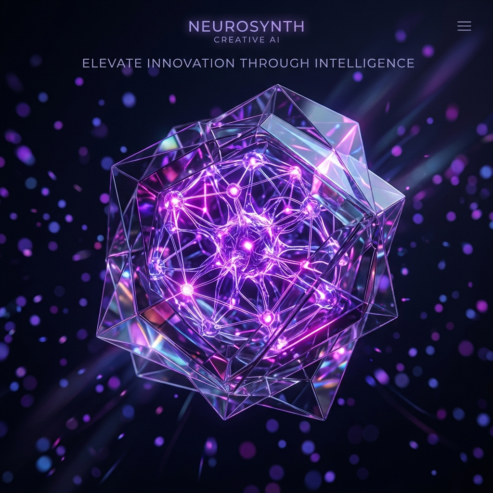

# 💎 Lumina — Next-Gen Creative AI Agency

Lumina is a premium, high-fidelity website for a futuristic creative agency. Built with a "Midnight Luxe" aesthetic, it leverages AI-driven creativity to deliver world-class digital experiences.



## 🛠️ Tech Stack

<p align="left">
  
  
  
  
</p>

- **Core**: HTML5, Semantic Structure
- **Styling**: Tailwind CSS (Optimized for performance)
- **Interactivity**: Vanilla JavaScript with hardware-accelerated animations
- **Icons**: Lucide Icons
- **Visuals**: AI-Generated 3D Assets (DALL-E 3)

## ✨ Key Features

- 🌑 **Midnight Luxe Theme**: Deep obsidian palette with glassmorphism.
- 🚀 **Zero-Lag Architecture**: Optimized for performance with Tailwind CSS.
- 🧊 **3D Tilt Effects**: Interactive mouse-tracking 3D effects on cards.
- 🌊 **Smooth Reveal**: Progressive entrance animations on scroll.
- 📱 **Fully Responsive**: Seamless experience across mobile, tablet, and desktop.
- 🖼️ **AI Visuals**: Custom-generated 3D assets for a unique identity.

## 📁 Project Structure

```bash
Lumina-AI-Website/
├── assets/           # AI Generated Images
├── index.html        # Homepage
├── about.html        # About Us Page
├── services.html     # Services & Pricing Page
├── contact.html      # Contact & FAQ Page
├── script.js         # Interactive Logic & 3D Effects
└── README.md         # Project Documentation
```

## 🚀 Getting Started

1. Clone the repository.
2. Open `index.html` in any modern web browser.
3. Experience the future of AI-driven design.

---
Created with ❤️ by **Antigravity AI**
